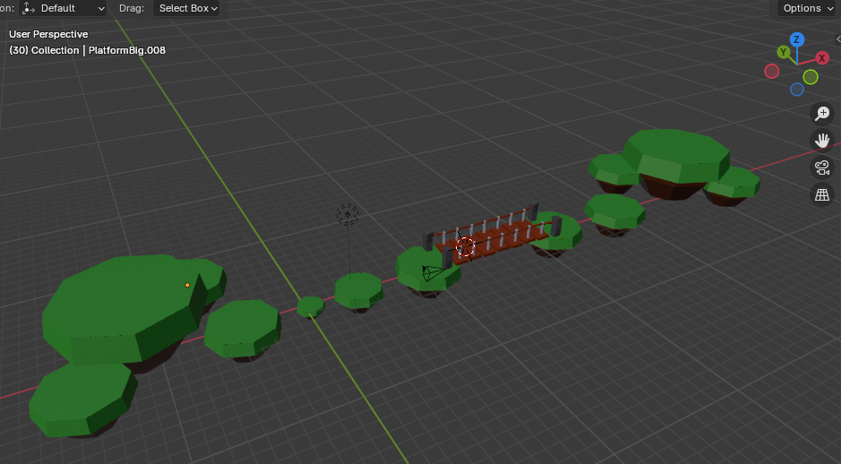

# Platformer

- Jogo desenvolvido durante o curso <a href="https://www.udemy.com/course/aprenda-de-uma-vez-faca-seu-jogo/learn/lecture/15443050?start=0#overview">Aprenda a criar modelos 3d simples para jogos e utiliza-los.
</a>

- Artes 3D feitas em Blender

- Utiliza Godot Engine

